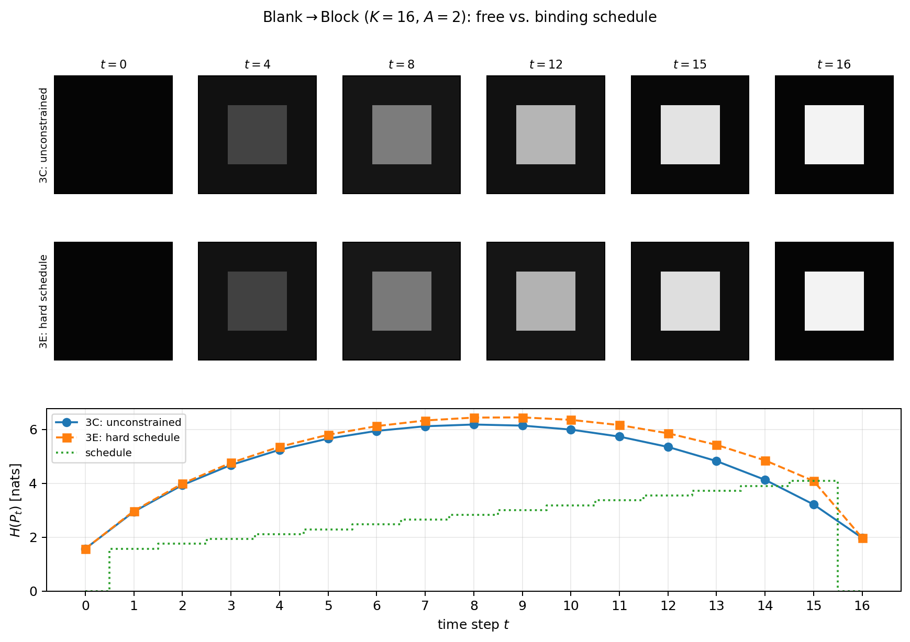

# Entropy-Constrained Schrödinger Bridges: paper code

This is the publication-facing code for *Entropy-Constrained Schrödinger
Bridges for Controllable Discrete Generation*. The 12-page paper gives only a
compact numerical-validation summary; this repository preserves the complete
definitions and outputs of the three supporting workflows:

1. exact toy validation of the factorized solver;
2. binary \(4\times4\) Blank-to-Block bridges;
3. the amortized MNIST heuristic and its schedule ablations.

The exploratory experiments from the research workspace are deliberately
excluded.

## Installation

Python 3.10 or newer is recommended.

```bash
python -m venv .venv
source .venv/bin/activate
pip install -r requirements.txt
```

For MNIST, install the additional PyTorch dependencies:

```bash
pip install -r requirements-mnist.txt
```

For the smoke tests, install `requirements-dev.txt` and run `pytest`.

## 1. Exact toy validation

### Purpose and setup

This experiment checks whether the factorized IPF--Dykstra implementation
recovers the exact optimizer of the hard entropy-constrained bridge. It compares
the factorized solver with a CVXPY program that explicitly represents the
complete path law.

Both cases use \(K=2\) tokens and \(N=3\) transitions. The initial and terminal
laws equal the correlated stationary law \(\pi_A\), and the reference is the
stationary single-site Gibbs chain

\[
R_A(x_{0:N})=\pi_A(x_0)\prod_{t=0}^{N-1}G_A(x_t,x_{t+1}),\qquad
G_A(x,y)=\frac12\sum_{k=1}^2
\mathbf 1_{\{y_{-k}=x_{-k}\}}\pi_A(y_k\mid x_{-k}).
\]

Thus one of the two coordinates is selected uniformly and resampled from its
conditional distribution under \(\pi_A\). The endpoint-only optimizer is the
reference itself and has constant erasure entropy. We impose active
erasure-entropy floors at times \(j=1,2\):

- binary alphabet \(A=2\): \(a_1=a_2=0.60\) nats;
- ternary alphabet \(A=3\): \(a_1=a_2=0.75\) nats.

### Recorded results

| Case | \((A,K,N)\) | Direct path variables | Stored potential entries | Entropy lift over free bridge | Direct KL | Absolute KL gap | Path TV | Max. violation |
| --- | ---: | ---: | ---: | ---: | ---: | ---: | ---: | ---: |
| Binary | \((2,2,3)\) | 256 | 16 | 0.100 | 0.043718 | \(2.05\times10^{-7}\) | \(3.05\times10^{-7}\) | \(1.93\times10^{-7}\) |
| Ternary | \((3,2,3)\) | 6,561 | 36 | 0.052 | 0.004435 | \(4.93\times10^{-8}\) | \(1.60\times10^{-6}\) | \(3.18\times10^{-7}\) |

The positive entropy lifts show that the endpoint-only bridge violates the
chosen floors. The objective gaps, complete-path total variation, endpoint
errors, and constraint violations show that the factorized iteration recovers
the direct optimum to numerical accuracy. This is a solver validation and a
check of the \(O(NA^K)\) representation, not evidence that the entropy
constraint improves perceptual sample quality.

### Reproduce

```bash
python toy/run_validation.py --output-dir toy/output
```

Run only one case with `--case binary` or `--case ternary`. The command writes
`results.json` and `table.md` and exits unsuccessfully if any validation check
fails. The recorded paper outputs are in
[`toy/expected`](toy/expected).

## 2. Binary 4x4 experiment

### Purpose and setup

This experiment demonstrates the factorized scheme at \(K=16\), \(A=2\), and
\(T=16\), where one marginal contains \(2^{16}=65{,}536\) states. A direct path
representation would contain
\(65{,}536^{17}\approx10^{82}\) variables, whereas the factorized solver stores
17 state potentials, about \(1.1\times10^6\) floating-point entries.

The endpoints are product-Bernoulli image laws:

- **Blank:** every pixel is one with probability \(0.02\), with
  \(H=1.5686\) nats;
- **Block:** the central \(2\times2\) pixels are one with probability \(0.95\)
  and all other pixels with probability \(0.02\), with \(H=1.9705\) nats.

At every bridge interval the reference chooses one coordinate uniformly and
redraws it from Bernoulli\((1/2)\), independently of the current configuration.
Consequently,
\(\mathcal K(x,x)=1/2\), \(\mathcal K(x,y)=1/(2K)\) at Hamming distance one,
and all other transitions are zero. There is one such Gibbs update per
interval and \(K+1=17\) nonzero transitions per row.

### Reachability and the three runs

The support-envelope bound gives

\[
H(P_{15})\le H(P_{16})+\log 17
=1.9705+\log17=4.8037\ \text{nats}.
\]

It therefore certifies that a 6-nat hard target at \(t=15\) is infeasible. The
feasible hard run uses \(0.85\times4.8037=4.0832\) nats instead. The runner
materializes exactly three cases:

- **3C:** unconstrained bridge;
- **3E:** hard joint-entropy schedule ending at \(4.0832\) nats;
- **3G:** hinge penalty with \(\beta=2\) at the deliberately unreachable
  6-nat schedule.

| Run | Formulation | Target at \(t=15\) | \(H(P_{15})\) | Deficit | Cycles | Recorded time |
| --- | --- | ---: | ---: | ---: | ---: | ---: |
| 3C | Unconstrained | -- | 3.2111 | -- | 5 | 2.2 s |
| 3E | Hard constraint | 4.0832 | 4.08318 | \(2.06\times10^{-6}\) | 60 | 24.9 s |
| 3G | Hinge penalty | 6.0000 | 4.4597 | 1.5403 | 37 | 15.5 s |

The unconstrained bridge has a natural entropy hump, peaking at \(6.1793\)
nats at \(t=8\) before falling to \(3.2111\) at \(t=15\). The binding
constraint in 3E raises the late entropy and propagates backward through the
descent. It changes the displayed first moment only slightly: at \(t=15\), the
mean central-block pixel is \(0.887\) in 3C versus \(0.871\) in 3E, while the
mean background pixel is \(0.035\) versus \(0.056\). This is a limitation of
joint-entropy control and the displayed pixelwise mean, not a comparison
between joint and erasure entropy.

Run 3G shows the role of a soft penalty when the requested hard schedule is
unreachable: the solver preserves the endpoints and converges, but accepts a
finite 1.5403-nat shortfall. It does not claim to maximize the entropy
attainable under the reference.



### Reproduce

```bash
python four_by_four/run_experiment.py
```

The state space contains \(2^{16}=65{,}536\) states. A typical CPU run takes
about one minute. Results and the Blank-to-Block figure are written to
`four_by_four/output/`. To regenerate only the figure from the recorded result:

```bash
python four_by_four/run_experiment.py --figures-only
```

The script verifies convergence of all runs, endpoint errors below
\(10^{-6}\), the hard constraint to \(10^{-5}\), the expected hinge shortfall,
and the per-step entropy-increment bound \(|H(P_{t+1})-H(P_t)|\le\log17\).
The configuration is in
[`four_by_four/config.yaml`](four_by_four/config.yaml), and the recorded
machine-readable output is
[`four_by_four/expected/paper_results.json`](four_by_four/expected/paper_results.json).

## 3. MNIST experiment

The MNIST workflow has three training stages:

```bash
python mnist/train_vqvae.py
python mnist/train_masked_model.py
python mnist/train_noise_mtms.py
```

The first command downloads MNIST, trains the VQ-VAE, and saves the \(7\times7\)
token arrays. The second trains the clean-token masked model. The third creates
the \(T+1=9\) stored models: the clean model at \(t=8\), seven independently
fine-tuned intermediate models, and the \(t=0\) model whose predictions are
used only to evaluate the displayed \(t=0\) proxy. Generation itself starts
directly from the uniform source and does not apply that duplicate model.

Run the five reported generation conditions with:

```bash
python mnist/run_ablations.py
```

The paper checkpoints are included according to
[`mnist/checkpoints/README.md`](mnist/checkpoints/README.md). A different set
can be supplied from another directory:

```bash
python mnist/run_ablations.py --checkpoint-dir /path/to/checkpoints
```

The runner records its random seed, numerical settings, and all entropy
profiles in `mnist/output/results.json`. The quantity plotted here is the
model-based predictive-entropy proxy defined in the paper, not the exact erasure
entropy of an unknown Schrödinger bridge marginal. The MNIST construction is an
amortized heuristic; its sampling laws \(Q_t\) are not asserted to approximate
the exact optimum \(P_t\). Stochastic generation and device-specific kernels
mean newly trained checkpoints need not reproduce the rounded paper values
exactly. The recorded outputs and figures are in [`mnist/expected`](mnist/expected).

## 4. Full-version entropy comparison

The deterministic joint-versus-erasure-entropy comparison removed from the
12-page version can still be generated with:

```bash
python scripts/generate_entropy_functional_comparison.py
```

It writes `scripts/output/entropy_functional_comparison.pdf`.

## Repository map

```text
modules/          minimal shared implementation
toy/              exact path-space versus factorized validation
four_by_four/     Blank-to-Block runs 3C, 3E, and 3G
mnist/            amortized training and schedule ablations
scripts/          deterministic full-version comparison figure
```

## License

This repository is released under the [MIT License](LICENSE).
